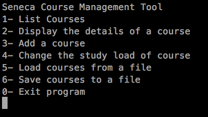
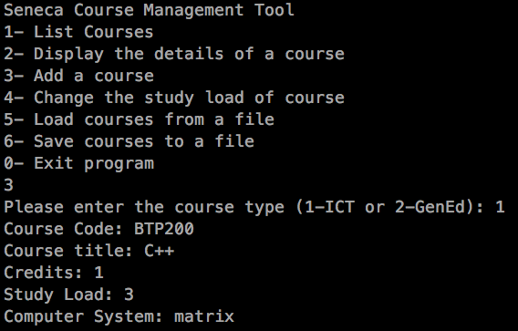
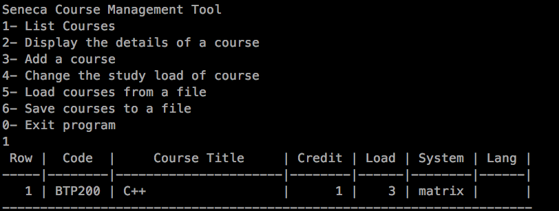
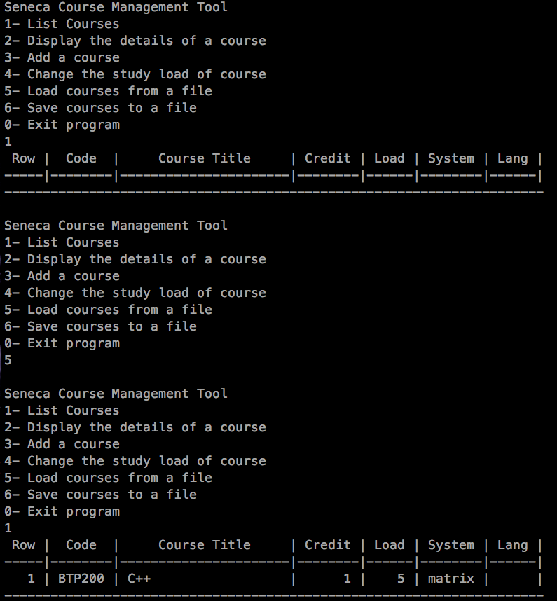

# Course Manager

This application was written as a final project for 3rd semester C++ course at Seneca College. It is a proof of concept application for managing different courses along with their course load.

## How to compile the code

1. Download the source files and place them in a folder called "course_mgr"
2. Open up terminal and navigate inside "course_mgr" directory
3. Use g++ to compile the c++ code. Use the following command: `g++ -std=c++11 -o course_mgr *.cpp`
4. Execute `./course_mgr` in terminal to launch the app.

## Screenshots

